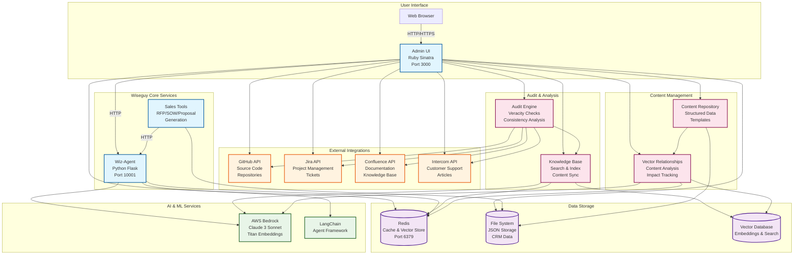

# Wiseguy - Technical Architecture Overview

## 🏗️ System Architecture Diagram

## 🔧 Core Components

### 1. **Admin UI (Ruby Sinatra)**
- **Port**: 3000
- **Purpose**: Main web interface for Wiseguy
- **Features**:
  - Dashboard with system overview
  - CRM management (organizations, contacts, pipeline)
  - Sales tools project management
  - Knowledge base administration
  - Audit execution and monitoring
  - Settings and configuration

### 2. **Wiz-Agent (Python Flask)**
- **Port**: 10001
- **Purpose**: AI microservice for intelligent interactions
- **Features**:
  - LangChain agent framework
  - AWS Bedrock integration (Claude 3 Sonnet)
  - Conversation memory and session management
  - Tool integration for various operations
  - Health monitoring and status reporting

### 3. **Sales Tools**
- **Purpose**: AI-powered sales document generation
- **Features**:
  - RFP (Request for Proposal) generation
  - SOW (Statement of Work) creation
  - Proposal development
  - Template management
  - CRM integration for customer tracking

## 🗄️ Data Storage

### 1. **Redis**
- **Port**: 6379
- **Purpose**: Caching and vector storage
- **Usage**:
  - Session management
  - Content caching
  - Vector embeddings storage
  - Real-time data access
  - Performance optimization

### 2. **File System (JSON Storage)**
- **Purpose**: Persistent data storage
- **Stores**:
  - CRM data (organizations, contacts, activities)
  - Sales tools projects
  - Configuration files
  - Audit results
  - Content metadata

### 3. **Vector Database**
- **Purpose**: Semantic search and similarity matching
- **Features**:
  - Document embeddings storage
  - Content similarity search
  - Knowledge base indexing
  - Relationship mapping

## 🤖 AI & Machine Learning

### 1. **AWS Bedrock**
- **Models**:
  - Claude 3 Sonnet (2024-02-29-v1:0) for text generation
  - Titan embeddings for vector generation
- **Features**:
  - High-performance LLM access
  - Scalable AI processing
  - Enterprise-grade security
  - Cost-effective AI operations

### 2. **LangChain**
- **Purpose**: Agent framework and tool orchestration
- **Features**:
  - Tool integration and management
  - Conversation memory
  - Agent reasoning and decision making
  - Prompt engineering and optimization

## 🔗 External Integrations

### 1. **GitHub Integration**
- **Purpose**: Source code analysis and impact assessment
- **Features**:
  - Repository monitoring
  - Pull request analysis
  - Code change impact tracking
  - Documentation consistency checks

### 2. **Jira Integration**
- **Purpose**: Project management and ticket tracking
- **Features**:
  - Ticket synchronization
  - Project status monitoring
  - Issue tracking and analysis
  - Workflow automation

### 3. **Confluence Integration**
- **Purpose**: Documentation management and consistency
- **Features**:
  - Page synchronization
  - Content veracity checks
  - Documentation updates
  - Knowledge base integration

### 4. **Intercom Integration**
- **Purpose**: Customer support and knowledge management
- **Features**:
  - Article synchronization
  - Support ticket analysis
  - Customer feedback integration
  - Knowledge base updates

## 📊 Content Management

### 1. **Content Repository**
- **Purpose**: Structured content storage and management
- **Features**:
  - Template management
  - Content categorization
  - Version control
  - Metadata management

### 2. **Vector Relationships**
- **Purpose**: Content analysis and relationship mapping
- **Features**:
  - Semantic similarity analysis
  - Content impact assessment
  - Relationship visualization
  - Cross-reference management

## 🔍 Audit & Analysis

### 1. **Audit Engine**
- **Purpose**: Veracity and consistency checking
- **Features**:
  - Cross-platform consistency verification
  - Content accuracy validation
  - Impact analysis
  - Automated reporting

### 2. **Knowledge Base**
- **Purpose**: Centralized knowledge management
- **Features**:
  - Content indexing and search
  - Multi-source integration
  - Semantic search capabilities
  - Knowledge graph construction

## 🌐 Network Architecture

### Port Configuration
- **3000**: Admin UI (HTTP)
- **10001**: Wiz-Agent (HTTP)
- **6379**: Redis (TCP)
- **443**: External APIs (HTTPS)

### Security
- Environment-based configuration
- API key management
- Secure external integrations
- Data encryption in transit

## 📈 Scalability & Performance

### Horizontal Scaling
- Stateless service design
- Redis-based session management
- Load balancing ready
- Microservice architecture

### Performance Optimization
- Redis caching layer
- Vector database for fast search
- Async processing capabilities
- Content pre-indexing

## 🔄 Data Flow

1. **User Request** → Admin UI
2. **AI Processing** → Wiz-Agent (via HTTP)
3. **External Data** → GitHub/Jira/Confluence/Intercom APIs
4. **Storage** → Redis (cache) + File System (persistent)
5. **AI Analysis** → AWS Bedrock + LangChain
6. **Results** → Admin UI → User

## 🛠️ Development & Deployment

### Technology Stack
- **Backend**: Ruby (Sinatra), Python (Flask)
- **Frontend**: HTML, CSS, JavaScript
- **Database**: Redis, JSON files
- **AI**: AWS Bedrock, LangChain
- **Integrations**: REST APIs

### Deployment
- Container-ready architecture
- Environment-based configuration
- Health check endpoints
- Monitoring and logging

This architecture provides a robust, scalable foundation for Wiseguy's AI-powered platform, enabling comprehensive content management, intelligent analysis, and seamless integration with external systems.
